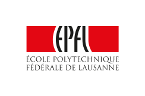

Applied Data Analysis is a course given by Professor Robert West to EPFL master's students.
The course teaches the basic techniques and practical skills necessary to understand a variety of data, using the most renowned software tools in the world of data science such as pandas, scikit-learn, Spark, etc.
The project you discover here is the final step in putting this semester knowledge into practice. It was realized by an atypical triptych of students, I mean, the three of us:
* Konstantinos Koukas: computer science master's student
* Nicolas Fontbonne: electrical engineering master's student
* Jeremy Wanner: bio-mechanical engineering master's student

We hope you enjoyed this work as we did creating it.

Thank you for coming this far and be careful with what you read!

## Contact

* [Nicolas Fontbonne](nicolas.fontbonne@epfl.ch)
* [Konstantinos Koukas](konstantinos.koukas@epfl.ch)
* [Jeremy Wanner](jeremy.wanner@epfl.ch)
